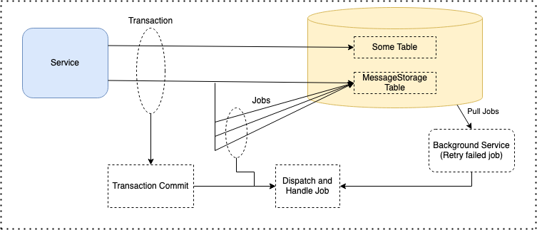

# Message Storage

MessageStorage is a library prepared to be used in projects that want to apply the **Outbox** design pattern.

| Platform | Status |
| ------- | ----- |
| `Travis` |  |
| `GitHub` |  |


| NuGet Package Name | Version |
| ------- | ----- |
| MessageStorage.SqlServer |  |
| MessageStorage.Postgres |  |
| MessageStorage.Integration.MassTransit |  |

## Structure Overview



## Getting Started

You can download the _MessageStorage.SqlServer_ or _MessageStorage.Postgres_ package
according to the storage environment you will use.

`UseSqlServer` / `UsePostgres` method lets you introduce SqlServer or Postgres is used for system's data storage.

`RegisterHandler` / `RegisterHandlers` method lets you introduce MessageHandlers that is used. When the message is recorded, the tasks that will be
executed in the background will be introduced through these classes.

### Sample Startup

 ```
 services.AddMessageStorage(configurator =>
 {
    configurator.UseSqlServer("SqlServerConnectionString");
    configurator.RegisterHandlers(messageHandlerAssemblies);
 })
 ```

After these steps, you can use the object that is an implementation of `IMessageStorageClient` interface.

### Sample Service

Example of registering SomeEntity and saving SomeEntityCreatedEvent message in the same transaction.

```
using (IDbConnection connection = _connectionFactory.CreateConnection())
{
    using IDbTransaction dbTransaction = connection.BeginTransaction(IsolationLevel.ReadCommitted);
    using IMessageStorageTransaction transaction = _messageStorageClient.UseTransaction(dbTransaction);
    
    await connection.ExecuteAsync( sqlCommandText, sqlCommandParameters, dbTransaction);

    SomeEntityCreated someEntityCreated = new (someEntity.Id, someEntity.SomeProperty, someEntity.CreatedOn); 
    await _messageStorageClient.AddMessageAsync(someEntityCreated);

    transaction.CommitAsync(cancellationToken);
}
```

After `transaction.CommitAsync`, created job will be dispatched and executed